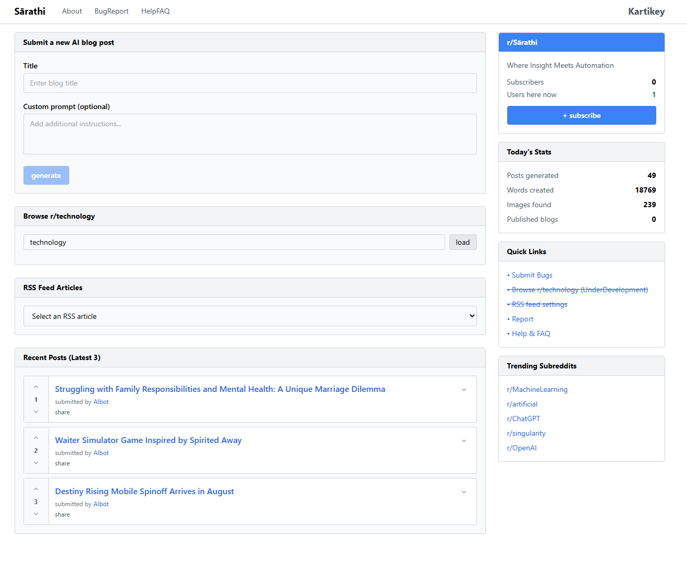

# 🧠 AI Blogger Automation Tool

An end-to-end AI blogging automation system that fetches topics from Reddit and RSS feeds, generates content using Ollama (LLaMA model), selects relevant images from Unsplash, and automatically publishes SEO-optimized blog posts to Blogger — all through a simple frontend dashboard.

[](https://sarathi-ai-automation.netlify.app)



---

## 📽️ Watch Live Demo

[](https://www.youtube.com/watch?v=m60RXUWmq_Q)

---

## 🚀 Features

- 🤖 **AI-Powered Content** — Generates full blog posts using LLaMA (via Ollama)
- 🌐 **Reddit + RSS Input** — Auto-fetches topics and headlines to generate from
- 🖼️ **Image Automation** — Adds Unsplash images using AI-generated prompts
- 📈 **Stats Dashboard** — Real-time metrics for posts, images, words, etc.
- 📅 **Auto Scheduling** — 4 blog posts daily with 30 min gap (cron jobs)
- ✍️ **SEO Titles** — Auto-generated optimized titles
- 🌍 **Frontend + Backend** — Fullstack system with Docker support

---

## 🧭 How It Works (Architecture)

This tool is a full AI-powered automation system built to create, enrich, and publish blog posts from live internet sources.

### 🔁 1. Topic Collection
- 🟥 **Reddit Scraper**
- 📰 **RSS Reader**

### 🧠 2. AI Content Generation (via Ollama + LLaMA)
### 🖼️ 3. Image Matching with Unsplash
### ✍️ 4. Publishing to Blogger
### 📅 5. Automation with Cron Jobs
### 📊 6. Live Dashboard (Frontend)
### 🐳 7. Docker-Based Deployment

---

## ✅ Summary Flow

```
Reddit / RSS  ➡️  AI Generate via LLaMA ➡️  Unsplash Images ➡️  SEO Title ➡️  Blogger Publish ➡️  Dashboard View
```

---

## 🤝 Contributing

We welcome contributions!
Contact - kartikeysepta@gmail.com

### 💡 How to Contribute
1. Fork → Clone → Branch → Code → PR

### 📂 Areas to Contribute
- More RSS feeds
- Better AI prompts
- UI improvements
- Docker/Nginx tuning

---

## 📜 License

MIT — free to use, modify, and distribute.
